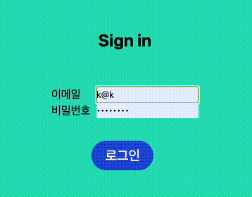

# 원티드 프리온보딩 프론트엔드 선발 과제
## 코드 작성자
+  지원자의 성명: 이호준
+ 프로젝트의 실행 방법: 
  1. `$ npm install`
  2. `$ npm start`
---
## 데모영상
### 1번 데모영상: Sign up
- Assignment1: 회원가입과 로그인 페이지에 이메일과 비밀번호의 유효성 검사기능을 구현해주세요
- Assignment2: 회원가입 페이지에서 버튼을 클릭 시 회원가입을 진행하고 회원가입이 정상적으로 완료되었을 시 `/signin` 경로로 이동해주세요

### 2번 데모영상: Sign in
- Assignment 3: 로그인 페이지에서 버튼을 클릭 시, 로그인을 진행하고 로그인이 정상적으로 완료되었을 시 /todo 경로로 이동해주세요

- Assignment 4: 로그인 여부에 따른 리다이렉트 처리를 구현해주세요

[__local storage에서 토큰 지웠을때__]

### 3번 데모영상: todo
Assignment 5~10
+ todo경로에 접속하면 투두 리스트의 목록을 볼 수 있도록 해주세요
+ 리스트 페이지에 새로운 TODO를 입력할 수 있는 input과 추가 button을 만들어주세요
+ TODO의 체크박스를 통해 완료 여부를 수정할 수 있도록 해주세요.
+ 투두 리스트의 수정 기능을 구현해주세요.

+ 투두 리스트의 삭제 기능
+ TODO 우측에 수정버튼과 삭제 버튼을 만들어주세요. 

--- 

